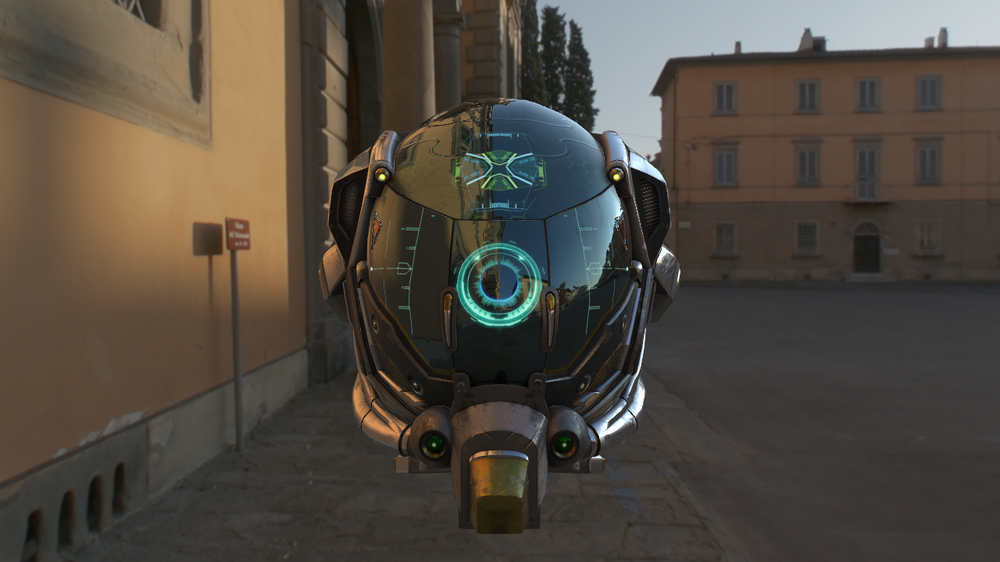
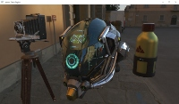
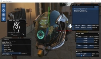
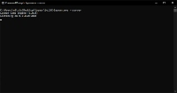

# Layman Game Engine (layman)

A simple 3D engine for the layman.

## Overview

- Portable on Windows, Linux and Mac.
- No programming or special knowledge required.
- Integrated all-in-one single executable (client, server and editor).

## Features

- [Client features](docs/features.md#client-features)
- [Server features](docs/features.md#server-features)
- [Editor features](docs/features.md#editor-features)

## Usage

Download the engine, launch it, hit the <kbd>F1</kbd> key.

## Screenshots

| Client example                                              | Editor example                                              | Server example                                              |
| ----------------------------------------------------------- | ----------------------------------------------------------- | ----------------------------------------------------------- |
|  |  |  |

## License

This is free and unencumbered software released into the public domain. See the [UNLICENSE](UNLICENSE) file for more details.
