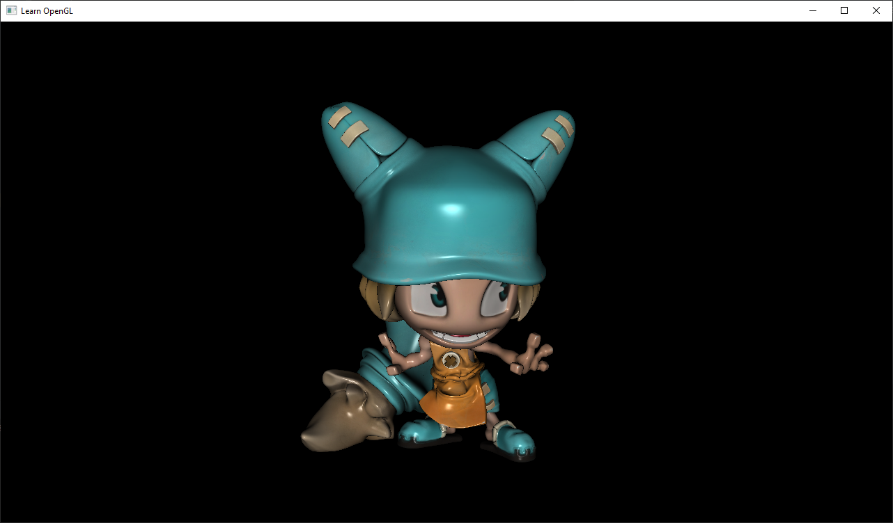

## Learn OpenGL (learngl)

Just a simple project while I'm learning OpenGL.

### Features so far:

- Creating a window and renderer with a modern OpenGL context.
- Entities have a model, texture, position, rotation and scale.
- Matrix and vector math utilities.
- Support .obj file format.
- Pan-tilt-zoom camera.
- Wireframe toggleable mode.

### Features planned:

- Lookup uniforms only once
- Numerous code refactors
    - Window handling events with camera/renderer imports
    - Toolkit collection/dynarray
- Drop SOIL, use libpng directly
- Per-pixel lighting
- Specular highlights
- Optimizations
    - Turn obj module into loader moduke
    - Meshes back-face culling
    - Batch rendering
- Terrain
- Transparency
- Fog
- Multi-texturing
- Player movement
- 3rd person camera
- Mipmapping
- Terrain collision
- Texture atlases
- GUI
- Multiple lights
- Point lights
- Day/night cycle
- Cell shading
- Normal mapping
- Font rendering
- Distance field text rendering
- Particle effects
- Instanced rendering
- Procedural terrain
- Shadow mapping
- Percentage closer filtering
- Antialiasing and anisotropic filtering
- Post-processing effects
- Gaussian Blur
- Multisampled FBOs
- Specular maps
- Bloom effect
- Multiple render targets
- Geometry shaders
- Cube map reflections
- Render to cube map texture
- Skeletal animation
- Lens flare
- Occlusion queries
- Water