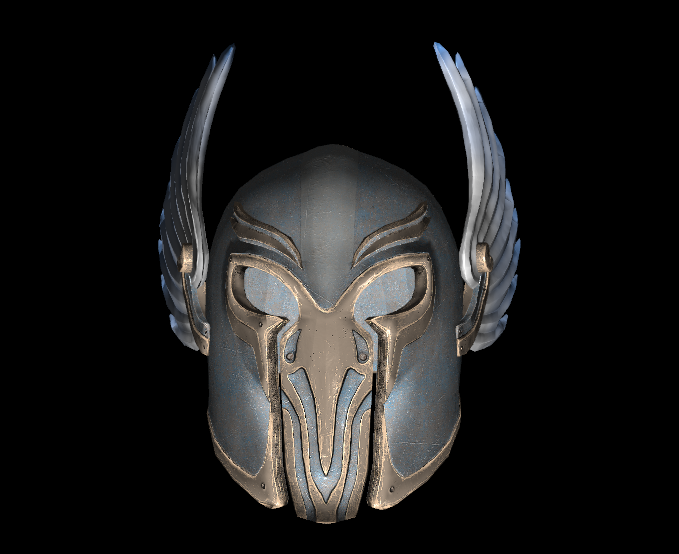

## Learn OpenGL (learngl)

Just a simple project while I'm learning OpenGL.

### Currently implemented

- Creating a window and renderer with a modern OpenGL context.
- Entities have a model, texture, position, rotation and scale.
- Matrix and vector math utilities.
- Support .obj file format.
- Wireframe toggleable modes for debugging.
- Phong lighting (ambient + diffuse + specular).
- Back-face culling optimization.
- High-resolution clock for elapsed-time calculation.
- Third person camera with tilt-pan-zoom offsets.
- Colored light (ambient + diffuse + specular).
- Materials (ambient + diffuse + specular + shininess).
- Flat terrain.

### Short term

- Transparency

### On the side

- Material emission.
- Toolkit collection/dynarray.
- Batch rendering using some kind of scene manager.
- Runtime keybinding system to map actions to GLFW key constants.
- Move includes back to .c files to hide impl details.
- Loading materials from files.
- Associating different materials to different mesh parts of a model.

### Long term

- Fog
- Multi-texturing
- Mipmapping
- Terrain collision
- Texture atlases
- GUI
- Multiple lights
- Point lights
- Day/night cycle
- Cell shading
- Normal mapping
- Font rendering
- Distance field text rendering
- Particle effects
- Instanced rendering
- Procedural terrain
- Shadow mapping
- Percentage closer filtering
- Antialiasing and anisotropic filtering
- Post-processing effects
- Gaussian Blur
- Multisampled FBOs
- Specular maps
- Bloom effect
- Multiple render targets
- Geometry shaders
- Cube map reflections
- Render to cube map texture
- Skeletal animation
- Lens flare
- Occlusion queries
- Water
